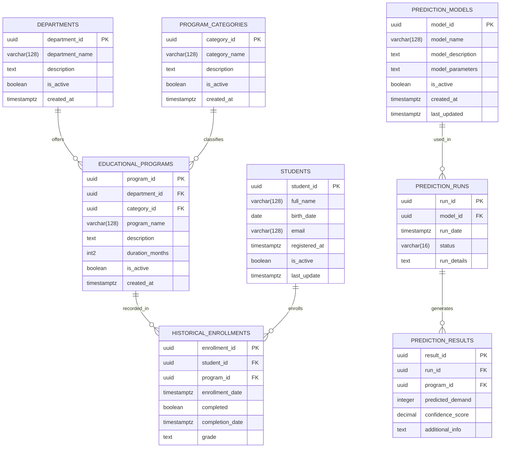
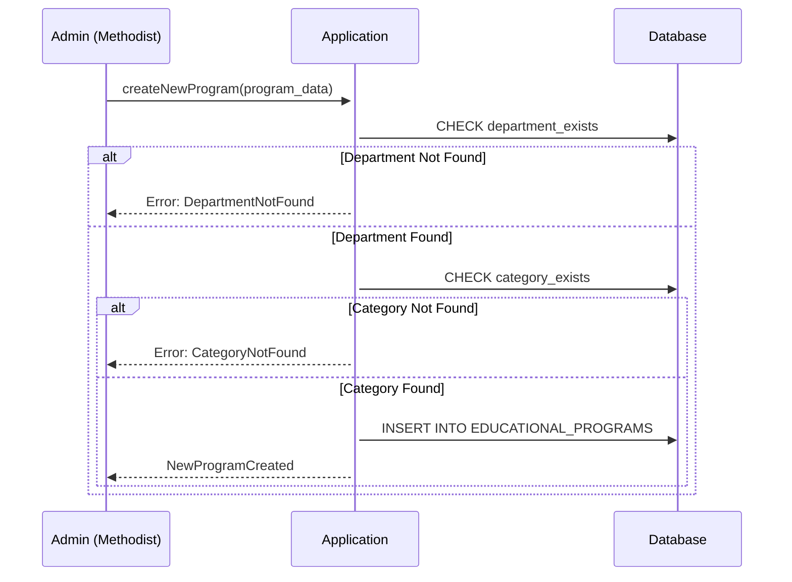
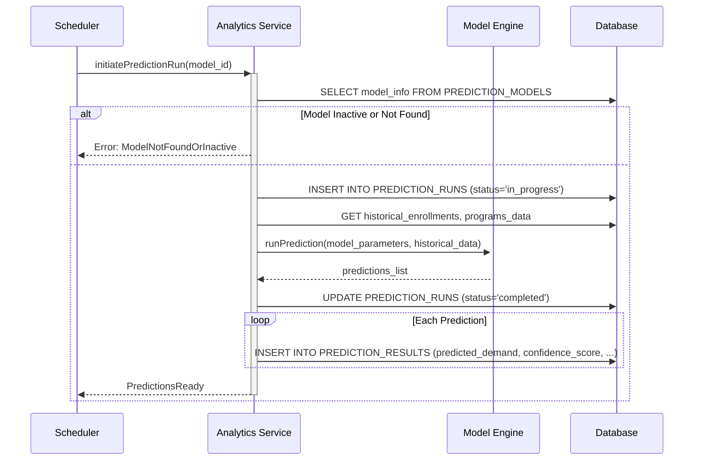

# Система предсказания спроса на образовательные программы

Система предназначена для хранения, анализа и прогнозирования спроса на образовательные программы. 

Центральная часть системы – таблицы **EDUCATIONAL_PROGRAMS**, **HISTORICAL_ENROLLMENTS**, **PREDICTION_MODELS**, **PREDICTION_RUNS** и **PREDICTION_RESULTS**, обеспечивающие механизм сбора исторических данных по зачислениям, запуск прогнозных моделей и хранение результатов.

Дополнительные таблицы **STUDENTS**, **DEPARTMENTS** и **PROGRAM_CATEGORIES** хранят справочную информацию: данные о студентах, кафедрах/факультетах и типах программ.

## Сценарий добавления новой образовательной программы
При создании новой образовательной программы требуется указать кафедру (факультет), категорию программы, длительность обучения и другую необходимую информацию. Система проверяет, существует ли указанная кафедра, и в случае отсутствия выдает ошибку. Если программа успешно создается, данные вносятся в таблицы EDUCATIONAL_PROGRAMS.

# Сценарий запуска предиктивной модели
Процесс запуска прогнозной модели спроса на образовательную программу включает подготовку исторических данных, выбор активной модели и создание записи о запуске (PREDICTION_RUNS). После расчёта результатов система сохраняет их в PREDICTION_RESULTS.

# Краткое описание основных таблиц

- **DEPARTMENTS**:
  Хранит информацию о кафедрах (факультетах), на которых открываются образовательные программы.

- **PROGRAM_CATEGORIES**:
Позволяет классифицировать образовательные программы по типу (бакалавриат, магистратура, курсы повышения квалификации и т. д.).

- **EDUCATIONAL_PROGRAMS**:
Основная сущность, описывающая каждую образовательную программу (название, описание, длительность, статус).

- **STUDENTS**:
Содержит данные о студентах, которые в дальнейшем анализируются для выявления исторических данных по зачислениям.

- **HISTORICAL_ENROLLMENTS**:
Исторические записи о зачислениях и прохождении студентами программ. Используются для обучения моделей.

- **PREDICTION_MODELS**:
Хранит информацию о доступных моделях прогнозирования (название, параметры, последнее обновление).

- **PREDICTION_RUNS**:
Запись о каждом запуске модели (дата запуска, статус и дополнительные детали).

- **PREDICTION_RESULTS**:
Содержит результаты работы модели по каждой программе (прогнозируемый спрос, степень уверенности и др.).

